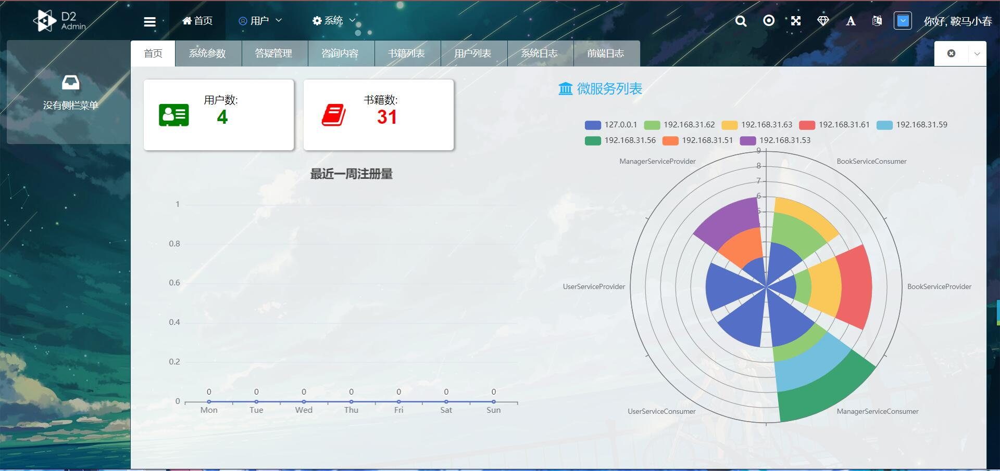

# Gabriel Web阅读器

Gabriel是基于Vue+SpringCloud Alibaba设计的支持**多种**电子书格式的Web端阅读器。  
且后端采用分布式开发，能在部署时自由分配各项服务的资源占比，同时大幅度提升项目可靠性和并发性能。

### 功能

* 在线阅读pdf、txt、epub格式的电子书
* 同步阅读进度
* 用户可对部分功能自定义设置
* 设置管理平台以监控各项数据
* 关键信息日志记录
* 用户、书籍信息管理
* 数据缓存机制

### 预览画面





## 部署相关
***
* ## 前端
### vue-ui
* **项目设置**  
*项目打包前应先安装所有依赖包*
```
npm install
```

* **运行测试**
```
npm run serve
```


* **项目打包编译**
```
npm run build
```
 
* **环境**  
项目在生产环境中，应将项目打包生成dist，并置于nginx目录下，并设置反向代理，将所有非后端请求指向index.html  

*示例代码*
```conf
server {
    listen       80;
    server_name  example.kyu92.top;
    rewrite ^(.*)$ https://$host$1 permanent;
}

server {
    listen       443 ssl;
    server_name  example.kyu92.top;

    server_tokens        off;
    ssl_certificate      ../example.kyu92.top.pem;
    ssl_certificate_key  ../example.kyu92.top.key;

    ssl_session_cache    shared:SSL:1m;
    ssl_session_timeout  5m;
    ssl_protocols        TLSv1.2;

    ssl_ciphers  HIGH:!aNULL:!MD5;
    ssl_prefer_server_ciphers  on;

    if ($scheme = http){
        return 301 https://$host$request_uri;
    }

    index index.html;
    root ../html/gabriel;

    location ~ ^\S+ServiceConsumer/ {
        proxy_set_header Host $host;
        proxy_set_header X-Real-IP $remote_addr;
        proxy_set_header X-Forwarded-For $proxy_add_x_forwarded_for;
        proxy_set_header X-Forwarded-Proto https;
        proxy_set_header Upgrade $http_upgrade;
        proxy_set_header Connection "upgrade";
        proxy_pass http://gateway:8100$request_uri;
        # error_log logs/cloud_err.log debug;
    }

    location ~ / {
        try_files $uri $uri/ /;
        expires 24h;
    }
}
```

### vue-d2-admin
*同上*
***

* ## 外置组件
## nacos
* **运行**     
    
    **单机模式**
    ```shell
    start startup.cmd -m standalone
    ```
    **集群模式**
    ```shell
    start startup.cmd
    ```
  
### 配置
server.port: 组件监听端口
nacos.inetutils.ip-address: IP地址（集群模式下必须设置为当前主机IP）
spring.datasource.platform: 数据源类型，本项目中请使用mysql
db.num: 数据库数量
db.url.0: 1号数据库jdbc链接
db.user.0: 用户名
db.password.0: 密码
*如果需要添加多个数据源，可以使用db.url.x的形式添加*

## sentinel
* **运行**
```shell
java -jar sentinel-dashboard-1.8.1.jar
```
*该组件无需修改配置，运行即可*

## seata

* *运行*  
  **windows**
  ```shell
  seata-server.bat
  ```
  **Linux/Mac**  
  ```shell
  seata-server.sh
  ```
  
### 配置
  *Seata中共有两项配置文件，file.conf和registry.conf*
  * file.conf: 本文件用于配置Seata事务过程文件储存方式，本项目中使用Mysql
    > datasource = "druid" 数据连接池类型，可选"druid", "dbcp", "hikari"  
    > dbType = "mysql" 数据库类型，请不要修改  
    > driverClassName = "com.mysql.cj.jdbc.Driver" 数据库连接驱动，mysql8无需修改，mysql5请改为com.mysql.jdbc.Driver  
    > url jdbc连接地址  
    > user 数据库连接用户名  
    > passwor 密码  
  * registry.conf: 本文件用于配置Seata配置储存方式和注册中心类型，本项目使用Nacos注册中心
    > application: 注册中心服务名  
    > serverAddr: 注册中心地址  
    > username: nacos用户名  
    > password: nacos密码
***
* ## 后端
详见各个后端项目压缩包中的README.md
#### 外置组件Docker运行命令
* nacos:
```shell
docker run -p 8848:8848 \ 
-v D:\IDEAWorkSpaces\gabriel-cloud\docker\nacos\conf:/home/nacos/conf \  
-v D:\IDEAWorkSpaces\gabriel-cloud\docker\nacos\logs \  
-v D:\IDEAWorkSpaces\gabriel-cloud\docker\nacos\access:/home/nacos/bin/logs \  
-e MODE="standalone" \  
--name gabriel-nacos-8848 \  
nacos/nacos-server
```
* nginx:
```shell
docker run -p 80:80 -p 443:443 -p 81:81 \  
--privileged=true \  
-v D:\IDEAWorkSpaces\gabriel-cloud\docker\nginx\conf:/etc/nginx \  
-v D:\IDEAWorkSpaces\gabriel-cloud\docker\nginx\html:/usr/share/nginx/html \  
--link gabriel-nacos-8848 \  
--name gabriel-nginx \  
nginx
```
* minio:
```shell
docker run -p 9000:9000 \  
--name gabriel-minio \  
-d --restart=always \  
-e "MINIO_ACCESS_KEY=minio" \  
-e "MINIO_SECRET_KEY=kyu92.top" \  
-v D:\IDEAWorkSpaces\gabriel-cloud\docker\minio:/data \  
-v D:\IDEAWorkSpaces\gabriel-cloud\docker\minio\config:/root/.minio \  
minio/minio server /data
```
* seata:  
  > Seata组件有进行一定的封装，所以需要先构建镜像或者从镜像仓库下拉
    * 构建镜像: `docker build -t gabriel/seata .`
    * 运行容器: 
      > ```shell
      > docker run --name gabriel-seata \  
      > -p 8091:8091 -e PORT=8091 \  
      > -v D:\IDEAWorkSpaces\gabriel-cloud\docker\seata\conf:/seata/conf \  
      > --link gabriel-nginx \  
      > gabriel/seata
      > ```

* sentinel:
  > Sentinel没有使用DockerHub上现成的镜像，需要自己构建或者从私有仓库下拉
    * 构建镜像: `docker build -t gabriel/sentinel .`
    * 运行容器: 
    > ```shell
    > docker run -p 8080:8080 \  
    > --name gabriel-sentinel \  
    > gabriel/sentinel
    > ```

* ## 数据库

*本项目共涉及5个数据库，sql文件全部储存在[sql文件夹](./sql)中*
  > * nacos: 储存Nacos相关的数据以及项目的配置文件
  > * seata: seata处理分布式事务的临时数据表，平时数据表内数据为空
  > * gabriel_user: 后端用户服务模块相关的数据表, 默认管理员用户: kyu92 密码123456
  > * gabriel_book: 后端书籍服务模块相关的数据表
  > * gabriel_manager: 后端管理服务模块相关的数据表

**原则上一个sql文件对应一个数据库系统，数据库之间互不干涉，必要时可以使用MyCat对数据库进行主从复制和读写分离操作**
